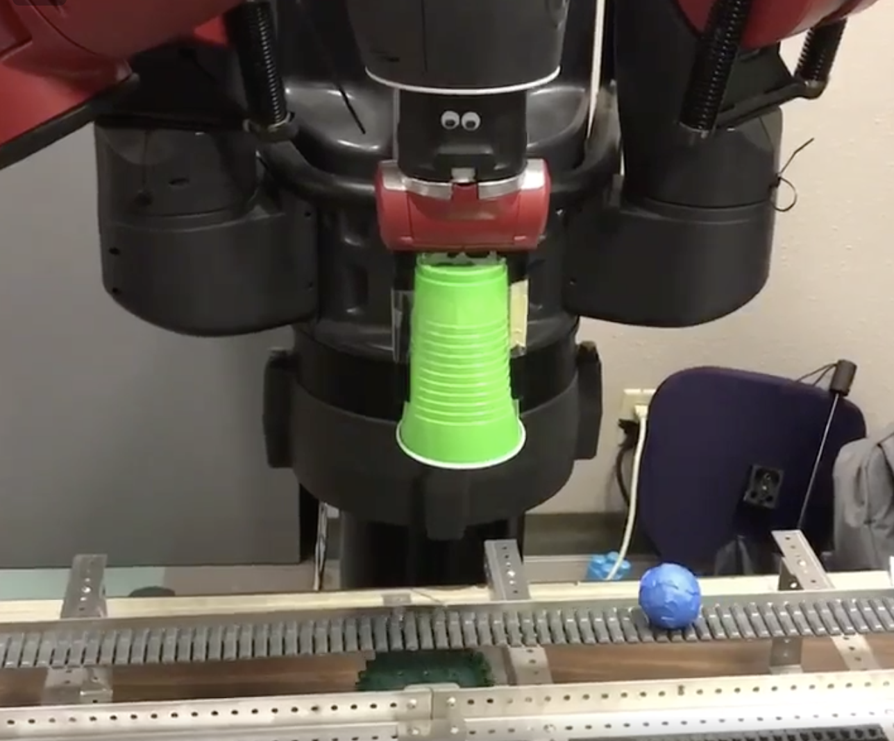
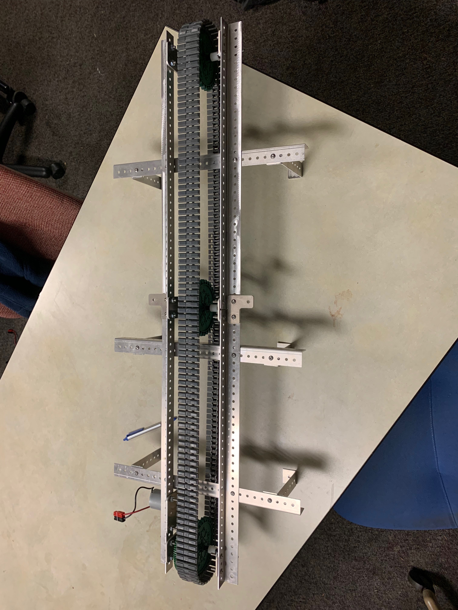
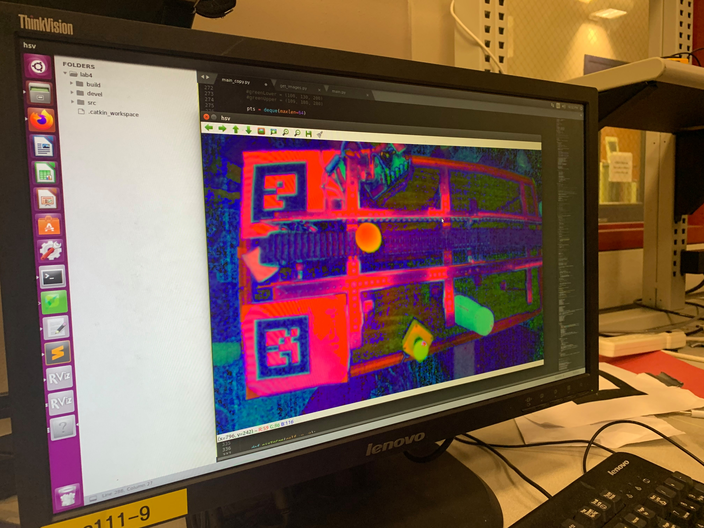
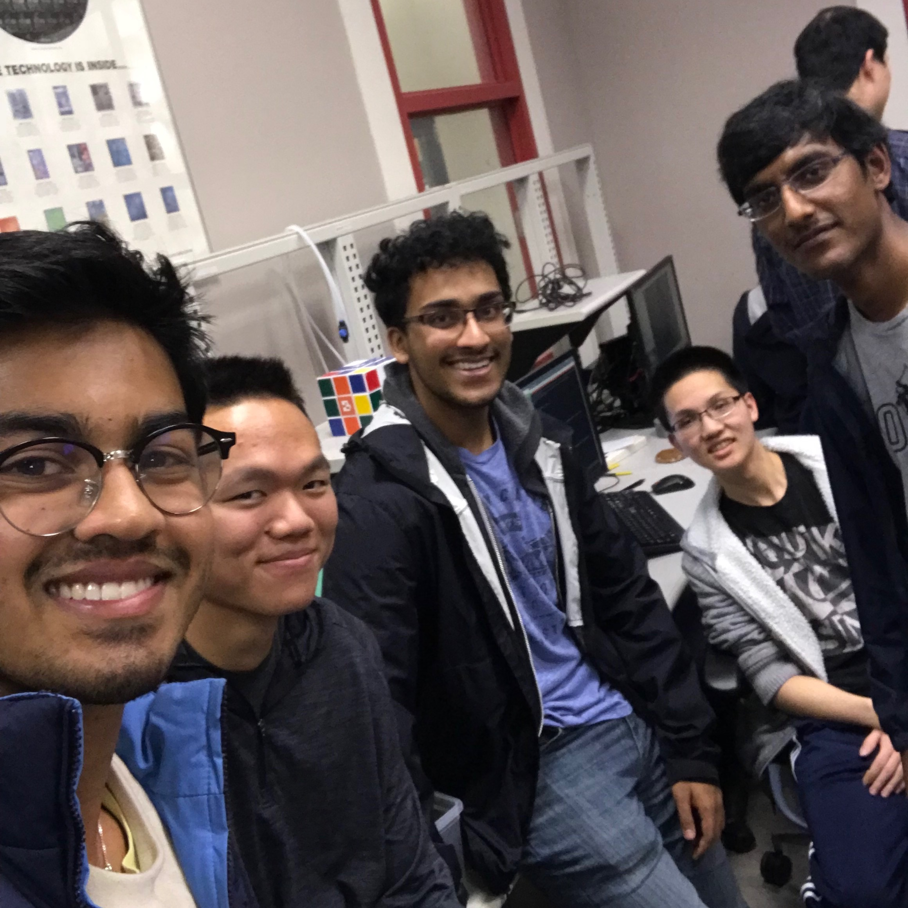

# EECS 106A Final Project: Stopping Robot

## Group 42: Aditya Ganapathi, Steven Lu, Aditya Nair, Mrunal Puram, William Wong

## 1. Introduction

##### a. Describe the end goal of your project. b. Why is this an interesting project? What interesting problems do you need to solve to make your solution work? c. In what real-world robotics applications could the work from your project be useful?

The end goal of our project is to be able to stop a moving object using Baxter as before it reached the end of its trajectory. Our project consistently stopped objects moving on a conveyor belt at variable speeds with a cup. In order to accomplish such reliability, we had to solve a few interesting problems: how to translate from a pixel captured by a camera to a world frame without depth; identifying an object and distinguishing it from its background or other objects; getting accurate velocity predictions; and being able to always find motion plans. Upon accomplishing this, we would be able to move on to stopping rolling objects, stopping one out of many objects, or even grasping and picking up the object. This project has many real-world applications, from assembly line robots that have to interact with objects moving along a conveyor belt to robots that could intercept and catch falling or thrown objects.

## 2. Design

##### What design criteria must your project meet? What is the desired functionality?

According to the project guidelines, our final project design required sensing, planning, and actuation, which that it must involve a real robotic task, on real hardware, using real sensors. The desired functionality was to have a robot detect, track, and stop a moving object. The project had to be robust to account for real-world inaccuracies and had to be efficient since it involves real-time motion detection, planning, and actuation.

##### Describe the design you chose.
We decided to use a Baxter robot for actuation. We used the left arm camera for sensing and detecting objects. We then used Baxter’s right arm to move to a desired calculation. All the computation and planning was done on the Baxter. We decided to use a conveyor belt in order to test with objects that move with a constant velocity.

##### What design choices did you make when you formulated your design? What trade-offs did you have to make?

- Our biggest decision was formulating how we were going to reliably move an object across a table. We first began with rolling a ping pong ball across a table but found that it was too light and often rolled unpredictably in different directions. We experimented with rolling a tennis ball instead, but the seams on the ball caused it to turn unexpectedly.  With a puck, there was too much friction on the table for us to be able to slide it across a significant amount. Modeling unpredictable rolling by the balls would be too difficult as there were too many variables to take into account including minor tilts in the table surface. We decided to instead build a conveyor belt that moved an object across the table in a predictable manner. We did not want to simplify our problem too much so our solution had the ability to handle variable speeds. Since the internal state was not synchronized with the speed of the conveyor belt, we ensured that the system was relying on motion tracking and could handle variable speeds for the conveyor belt.

- Another choice we had to make was whether to use the Baxter or Sawyer. The Baxter offered two arms, which allowed us to use the built-in camera, whereas the Sawyer only had one arm and no extra camera, but was faster and more accurate. Since the Baxter’s left hand camera was good enough for the project, along with the fact that there were 3 Baxters in the lab as opposed to 1 working Sawyer (there was a greater availability for a Baxter), we decided to use a Baxter.

- We also decided to not use a RealSense camera and instead used the Baxter’s left arm camera. This was a critical tradeoff as the RealSense camera could have provided a depth map and would have given us additional data to play with. However, we realized through tinkering with the Baxter that we did not need the depth values and instead calculated the intersection of the left arm camera’s ray with the plane to determine the position of an object in world coordinates.

##### How do these design choices impact how well the project meets design criteria that would be encountered in a real engineering application, such as robustness, durability, and efficiency?

- Our design choice made our project more applicable to current real world environments where robots on assembly lines see conveyor belts in front of them. Not having to create an extremely complex model of ball motion on a table with high variability allowed us to have high robustness as well as efficiency in CV and velocity calculation.

- By choosing a Baxter over Sawyer, we might have lost some accuracy as the Sawyer’s arm was faster and more precise, but the lack of a second arm/camera and the low availability would’ve required us to implement major changes to the project with limited timeslots.

- By not using a RealSense, we eliminated a potential point of failure and ensured the system was relatively simple. Maybe the RealSense would have been more useful for performing more complex tasks, but we feel that we did not need the $200 camera to efficiently perform the tasks we had outlined.

## 3. Implementation
##### Describe any hardware you used or built. Illustrate with pictures and diagrams.

We built a conveyor belt as a means of making the project more manageable, as dealing with the inconsistencies of identifying a rolling object and accounting for any friction or inconsistencies on the tables, which also varied between the different tables in the lab, proved to be too difficult, as there were too many factors to account for. By using the conveyor belt and constraining the velocity to be constant, we were able to test our actual implementation or algorithm consistently rather than deal with the aforementioned factors.

##### What parts did you use to build your solution?

To build the conveyor belt, we used pieces of metal as the frame, a DC motor, 12V lithium ion battery, some sprockets, and friction tank tread as the belt. To be able to control the speed of the conveyor, we used a custom motor controller PCB that one of our team members designed previously, which uses an Arduino to change the PWM signals to vary speed.
Other parts we used include solo cups and ping pong balls.

##### Describe any software you wrote in detail.

In order to accurately predict the velocity of the ball on the conveyor belt, we first needed to robustly track it through different backgrounds, lighting conditions and camera angles.  To do this, we first had to segment the ball in the image space.  We used the popular technique of thresholding in the HSV color space.  HSV is commonly used over RGB for thresholding due to its greater invariance to lighting by separating image intensity from color information.

Using this method and by fine-tuning the thresholding values, we were able to accurately segment the moving ball in the frame at real-time rates.  After segmenting the ball, we computed the center of mass of the segmented region by calculating the expectation of the blob.  We used this center of mass and its position over time to estimate the linear velocity of the ball.

<video src="images/cv_tracking.mp4" width="640" height="480" controls preload></video>

##### System overview and code explanation

**System Overview**

First, we use computer vision to identify and segment the ball, tracking its location in the camera pixel coordinates. From there, we convert the position into world coordinates, and track its movement over time in order to determine the velocity. The velocity, we are able to determine an intercept position to send the arm to. We then compute the motion plan, and send the arm to intercept the ball when the time comes.

**Code Explanation**
1. Most of our code was written in `/kin/src/scripts/final_code.py`. It takes in one command line argument, which is the number of the AR tag. At the bottom of the file, it initializes a new node and a new `StaticTransformBroadcaster`. It then initializes an `image_converter` object that we had defined and calls `ic.run()`.

2. The `image_converter`’s `init` function initializes a `Mover` object, which has a function `move` to move to a specified world coordinate. The `Mover` object also has a `delayed_move` function which we use to move it to the intercept position at the right time.

3. The `ic.getStopPosition()` function returns an intercept point and the time at which the arm needs to get there. It calls `ic.getDesiredPixel` (which returns  `ic.desiredPixel`, that is continuously overridden by the `callback` function that performs CV) to get the pixels at two different time steps. Once it gets the two pixels, it converts them to world coordinates using the `camToWorld` function.

4. The `camToWorld` function first converts the pixel to a ray in camera coordinates (`pixToCam`). This ray is then converted to world coordinates through the `rayToWorld` function, which calls the `LinePlaneCollision` function to determine where in world coordinates does the camera ray intersect with the plane of the detected object.

5. This world coordinate is now returned to the `getStopPosition` function, which then takes two world coordinates, finds dx and dt to calculate a velocity, and then calculates an intercept point and time based on the `time_to_stop` parameter. This intercept point is returned to the `run` function.

6. The `ic.run()` function is a continuous loop that moves to a specified start position, gets a new intercept position and time, and calls the `Mover.delayedMove()` function with that intercept position and time, and then loops back.

## 4. Results
##### How well did your project work? What tasks did it perform?

Based on our project proposal, and the task we outlined, our project worked as well as we could expect. Our program was able to:
- detect a blue ball
- isolate its velocity
- predict where it would be in _n_ seconds, and
- properly move the right gripper to cover the ball with a cup

### Demo Video
<video src="images/demo.mp4" width="640" height="480" controls preload></video>

Please check out more images and videos at the bottom of this page.

## 5. Conclusion

##### Discuss your results. How well did your finished solution meet your design criteria?

Our resulting product accomplished what we set out to accomplish. In terms of individual components, motion planning and actual robot motion was a bit difficult to maintain because it seemed small errors would compound (may reflect issues with encoders or us moving the arm improperly). The motion tracking component was a bit buggy, but it was robust enough to withstand 7-10 trials before needing to be rebooted. The integration of the two was robust - the majority of the latency was limited to motion planning.

##### Did you encounter any particular difficulties?
Yes. AR tags were very buggy to the point of stationary AR tags flickering on Rviz. Asimov had a topic and feed swapped, where the head camera topic would give us the left hand camera feed, the right hand camera topic would give us the  head camera feed. The TF tree had no connection between /reference vs /. Halfway through building the motion tracking, we realized that the lighting was quite variable, which led to variable functionality. This was fixed by tuning values and playing around with the algorithm used. The biggest issue we faced was inconsistencies across worksessions - working conditions were not stable. We found that moving from one robot to another led to massive changes in performance and calibration

##### Does your solution have any flaws or hacks? What improvements would you make if you had additional time?
No, the closest thing we had to a hack was the AR tags being used to determine the plane of operability. If we had the additional time, we would most likely implement our own controller, create our own motion planning system, and improve upon the computer vision side so it could handle bottles (for extensions) and other objects.

## 6. Team

*Aditya Ganapathi, William Wong, Aditya Nair, Steven Lu, Mrunal Puram*

### Aditya Ganapathi
> Aditya is a third year EECS and Business Administration major with experience in computer vision and robotics. He has conducted research in the AUTOLab at U.C. Berkeley under Prof. Ken Goldberg and has worked on projects relating to deformable object manipulation. In his free time, he enjoys watching football and going on hikes.

##### Contributions:
Aditya primarily worked on the computer vision module for this project which consisted of detecting and tracking the ball as it was moving on the conveyor belt.  He also spent a lot of time thinking through the design steps of the project as well as helping integrate all components.

### Steven Lu
>Steven is a third year EECS major. He is passionate about EE and hardware, and has experience in digital, analog, and PCB design. In his free time, he enjoys building puzzles, playing video and board games, and going to escape rooms.

##### Contributions:
Steven designed and built the conveyor belt for this project, complete with custom PCBs to power and control the speed of the motor driving the belt. He also worked on and contributed to the movement/motion planning and integration portions of the project.

### Aditya Nair
> Aditya is a third year EECS  major.  He is passionate about the intersection of multiple different fields with software engineering, including medical technology and finance.  When he gets the chance,  he plays  video  games  and does his  best to exercise (maybe after one more episode of brooklyn nine nine)

##### Contributions:
He worked on motion planning, testing and integration

### Mrunal Puram
> Mrunal is a third year EECS major. He is passionate about exploring the field of AI and robotics, and is also curious about astronomy. In his free time, he enjoys playing basketball, rooting for the Warriors, and reading tech blogs.

##### Contributions:
Mrunal helped implement the pixel to world coordinate transformation through the calculation of the plane ray intersection. He also contributed to the motion planning, testing, and integration portions of the project and refactored code. He was also responsible for setting up this website on GitHub Pages.

### William Wong
> William is a third year CS major with experience in software engineering, robotics and reinforcement learning. Outside of class, he conducts research under Professor Ken Goldberg at UC Berkeley’s AUTOLab.

##### Contributions:
William worked on robot motion planning, arm movement and transforming from pixel coordinate frame to world coordinates. He also assisted with setting up computer vision to handle a future extension of sorting objects moving down a conveyor belt.

## 7. Additional Materials

### Code
The code for the project can be found at the GitHub repo: [https://github.com/Stopping-Robot/106a-project](https://github.com/Stopping-Robot/106a-project)

There are two packages to look at: `ar_track_alvar` and `kin`. The `final_project_kin` folder can be ignored.

We modified `/kin/launch/ar_track.launch` from the course labs to work with the Baxter's left arm camera. Most of the project code we wrote is in `/kin/src/scripts/final_code.py`. Instructions to run the code can be found in the `README` in the repo.

#### Successful Run 1

<iframe src="https://drive.google.com/file/d/1BQAm_RjPR9sWDSu1Nwgtj4vPDHOydzAK/preview" width="640" height="480"></iframe>

#### Successful Run 2

<iframe src="https://drive.google.com/file/d/1suGYGNwerla3IVOqMhIisVCky3tWUqx2/preview" width="640" height="480"></iframe>

#### Incorrect velocity calculation

<iframe src="https://drive.google.com/file/d/1fNjhpO_wv8IXBtZxPNynihbfqFGpi8sk/preview" width="640" height="480"></iframe>

#### Erroneous motion planning

<iframe src="https://drive.google.com/file/d/1OA8bqGylb1t3J94DRzgeqRTQAbJtsRG4/preview" width="640" height="480"></iframe>
